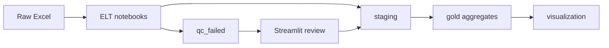
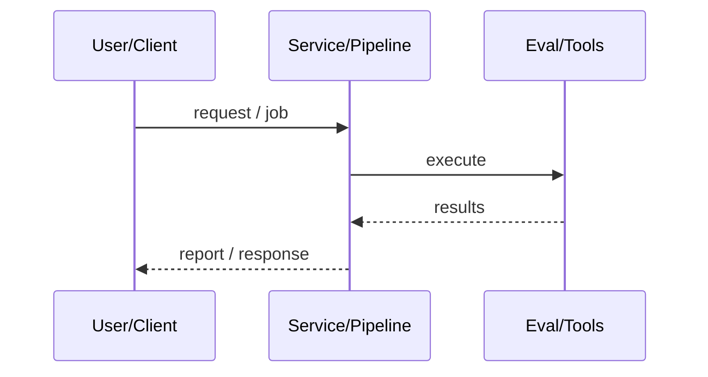
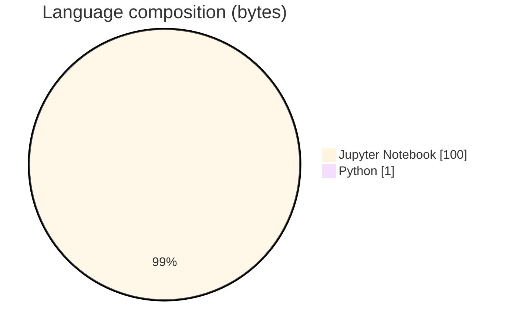

# Insurance Product Performance Analytics Platform

### Databricks-oriented claims ELT (raw→staging→gold) with QC-fail Streamlit review apps and synthetic NTA/MTC datasets.

[](https://github.com/ArchanaChetan07/Insurance-Product-Performance-Analytics-Platform)
[](https://github.com/ArchanaChetan07/Insurance-Product-Performance-Analytics-Platform)
[](https://github.com/ArchanaChetan07/Insurance-Product-Performance-Analytics-Platform)
[](https://github.com/ArchanaChetan07/Insurance-Product-Performance-Analytics-Platform/actions)

---

## Overview

Insurance product analytics needs governed medallion pipelines and a human workflow to fix QC-failed claims before they re-enter staging/gold aggregates.

Notebooks for ELT, staging-to-gold, aggregation, and visualization; processed parquet/csv layers committed; Streamlit QC review/push-to-staging UI; requirement/overview docs.

Reproducible synthetic claims lakehouse layout with Streamlit operator UI (path currently hard-coded to a local Desktop folder).

This repository is maintained as **production-minded portfolio work**: clear architecture, automated checks where present, and metrics that are **traceable to committed artifacts** (never invented).

---

## Architecture

Raw Excel → ELT notebook → staging/QC-failed → Streamlit fix/approve → gold aggregates → visualization





---

## Results & repository facts

> Only values found in code, configs, tests, or generated reports are listed. Absence of a clinical/ML accuracy number means it was **not** published in-repo.

| Metric | Value | Source |
|---|---|---|
| Tracked blobs on main | **24** | `git tree main` |
| Notebooks | **4** | `git tree main` |
| Tracked files | **24** | `git tree` |
| Python modules | **3** | `git tree` |
| Test-related paths | **1** | `git tree` |
| CI workflows | **Yes** | `.github/workflows` |
| Docker present | **No** | `repo root` |



---

## Key features

- claims_elt_pipeline + staging/gold notebooks
- QC failed partition + staging repair UI
- Claims visualization notebook
- Synthetic premiums/claims Excel sources
- Requirement + overview documents

---

## Tech stack

| Layer | Technology |
|---|---|
| language | Python |
| notebooks | Jupyter / Databricks-style ELT |
| storage | CSV/Parquet medallion layers |
| ui | Streamlit |
| domain | NTA/MTC insurance synthetic data |

---

## Skills demonstrated

Jupyter Notebook · pandas · PySpark/Databricks notebooks · Streamlit · Parquet · CI/CD · testing · automation

Keyword surface: **Python · Jupyter Notebook · machine-learning · CI/CD · testing · API · Docker · automation · data-science · software-engineering · system-design · observability · LLM · cloud**

---

## Project structure

```text
Insurance-Product-Performance-Analytics-Platform/
├── claims_elt_pipeline.ipynb
├── 03_staging_to_gold.ipynb
├── 04_aggregate_to_gold.ipynb
├── claims_Visulization.ipynb
├── Data/processed/{staging,gold,qc_failed}/
└── streamlit_ui/
```

---

## Installation & usage

```bash
git clone https://github.com/ArchanaChetan07/Insurance-Product-Performance-Analytics-Platform.git
cd Insurance-Product-Performance-Analytics-Platform
pip install -r requirements.txt
streamlit run streamlit_ui/claims_review_app.py
```

---

## How it works

ELT notebooks land synthetic claims into staging/gold parquet/csv; failed QC rows can be inspected and pushed back via Streamlit before aggregation/visualization notebooks consume gold tables.

---

## Future improvements

- Remove hard-coded Windows absolute paths in Streamlit.py
- Add data-quality metric cards from gold tables
- Rewrite template README with medallion diagram

---

## License

See repository.

---

<p align="center">
  <b>Insurance Product Performance Analytics Platform</b><br/>
  <a href="https://github.com/ArchanaChetan07/Insurance-Product-Performance-Analytics-Platform">github.com/ArchanaChetan07/Insurance-Product-Performance-Analytics-Platform</a>
</p>
