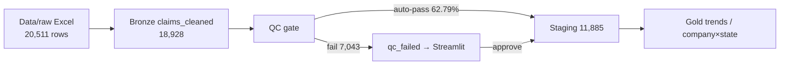

[](https://github.com/ArchanaChetan07/Insurance-Product-Performance-Analytics-Platform/actions/workflows/ci.yml)

Medallion ELT pipeline for synthetic insurance claims — **pandas + Parquet**, with **Streamlit HITL QC review** and **gold-layer KPI reporting**.

**18,928 bronze claims · 62.79% QC auto-pass (11,885 staged / 7,043 HITL) · 7.72% raw reject (1,583) · 14/14 tests · CI: green**

`docker compose up --build` → open Streamlit at `http://localhost:8501` (or `STREAMLIT_PORT=8502`).

[](pyproject.toml)
[](insurance_pipeline/)
[](streamlit_ui/claims_review_app.py)
[](docker-compose.yml)
[](tests/)

**Repo:** [github.com/ArchanaChetan07/Insurance-Product-Performance-Analytics-Platform](https://github.com/ArchanaChetan07/Insurance-Product-Performance-Analytics-Platform)

---

## Overview

End-to-end **insurance claims lakehouse sample** for synthetic NTA/MTC portfolios: ingest Excel → clean bronze → null/amount **QC gates** → **staging (silver)** vs **qc_failed (HITL)** → aggregate **gold** KPIs by state/month. Source of truth is `python -m insurance_pipeline.run` (not hard-coded notebook paths).

Verified this session via pipeline run → [`Data/processed/pipeline_metrics.json`](Data/processed/pipeline_metrics.json).

---

## Architecture



| Layer | What runs | Output |
|---|---|---|
| Raw → Bronze | `insurance_pipeline.bronze` | Drop null `CLAIM_NUMBER`/`POLICY`/`AMOUNT`/`DATE` → **18,928** |
| Bronze → Silver | `insurance_pipeline.qc` | Positive-amount auto-pass → staging; else HITL queue |
| Silver → Gold | `insurance_pipeline.gold` | Month×state trends + company×state totals |
| Entry point | `python -m insurance_pipeline.run` | Also writes `pipeline_metrics.json` |
| Operator UI | `streamlit_ui/claims_review_app.py` | Review/edit/approve failed rows into staging |

Exploration notebooks under repo root remain for ADS coursework context; **the package is the reproducible path**.

---

## Data quality / HITL workflow

1. **Raw reject (7.72%)**: 1,583 of 20,511 Sheet1 rows have non-numeric/null `AMOUNT` after parse — never enter bronze.  
2. **QC auto-pass (62.79%)**: of 18,928 bronze rows, **11,885** have `AMOUNT > 0` and required fields → staging.  
3. **HITL queue (7,043)**: non-positive amounts flagged `Invalid Amount` in `Data/processed/qc_failed/` for Streamlit repair.  
4. Operator edits + **Approve & Move to Staging** appends into silver and clears the failed file.

---

## Gold KPIs (verified this session)

Gold is rebuilt from the **auto-pass staging set** (not the old 101-row demo sample).

| Signal | Value |
|---|---:|
| Gold trend rows (month × state) | **1,726** |
| Months × states coverage | **60 months · 74 states** |
| Staged claim count in gold | **11,885** |
| Σ staged `TOTAL_CLAIMS` (amount) | **≈ $126.6M** |

Top states by Σ `TOTAL_CLAIMS` (gold):

| State | Σ TOTAL_CLAIMS |
|---|---:|
| TX | 15,786,816 |
| CA | 13,978,242 |
| PA | 5,454,978 |
| IL | 5,024,674 |
| AZ | 4,627,764 |
| NM | 4,621,700 |
| IN | 4,443,746 |
| FL | 4,005,753 |

---

## How to Run

```bash
git clone https://github.com/ArchanaChetan07/Insurance-Product-Performance-Analytics-Platform.git
cd Insurance-Product-Performance-Analytics-Platform

python -m venv .venv
# Windows: .\.venv\Scripts\Activate.ps1
source .venv/bin/activate
pip install -r requirements.txt
pip install -e .

python -m insurance_pipeline.run
streamlit run streamlit_ui/claims_review_app.py
```

Docker (recommended):

```bash
docker compose up --build
# open http://localhost:8501
# STREAMLIT_PORT=8502 docker compose up --build   # if 8501 is busy
```

**Data for CI/repro:** the full synthetic workbook is committed at `Data/raw/NTA_MTC_Claims_Synthetic_Data.xlsx` (not generated at runtime).

---

## Tests

```bash
pytest tests/ -v --tb=short
```

Verified this session: **14/14 passed** (7 legacy analytics smokes + 7 medallion/pipeline tests against the real workbook).

CI runs flake8, `python -m insurance_pipeline.run`, pytest, and a Docker image build on every push/PR to `main`.

---

## Tech Stack

| Layer | Technology |
|---|---|
| Package | `insurance_pipeline/` (`bronze`, `qc`, `gold`, `run`) |
| Data | pandas · Parquet · openpyxl |
| HITL UI | Streamlit |
| Containers | Dockerfile · Docker Compose |
| CI | GitHub Actions (real pytest — no swallowed exits) |

---

## License

See repository. Requirement PDF and Databricks overview DOCX are included for coursework context.

## Author

**Archana Chetan** · [@ArchanaChetan07](https://github.com/ArchanaChetan07)
