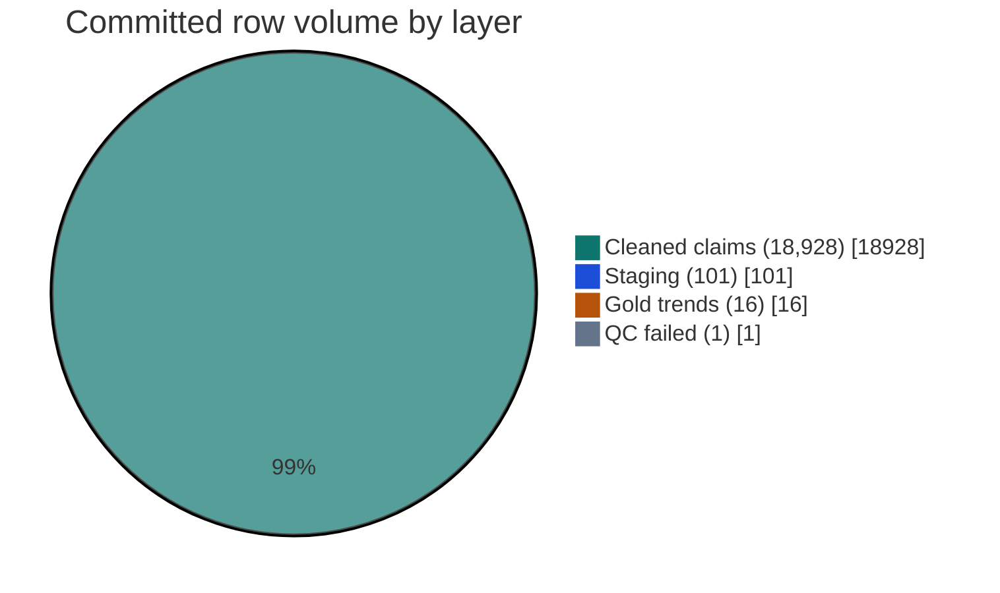
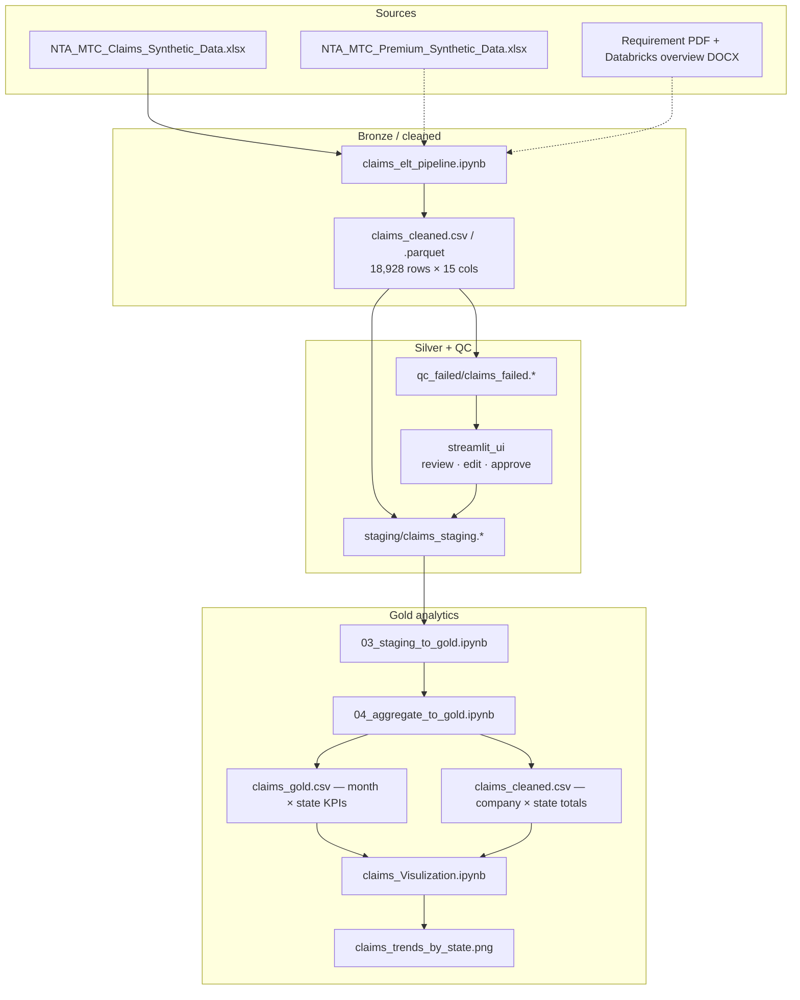
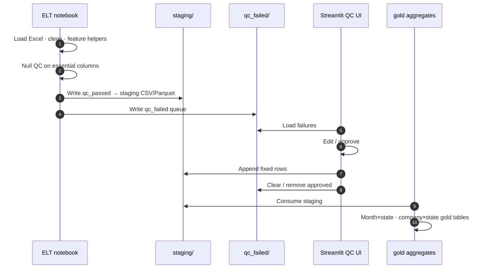
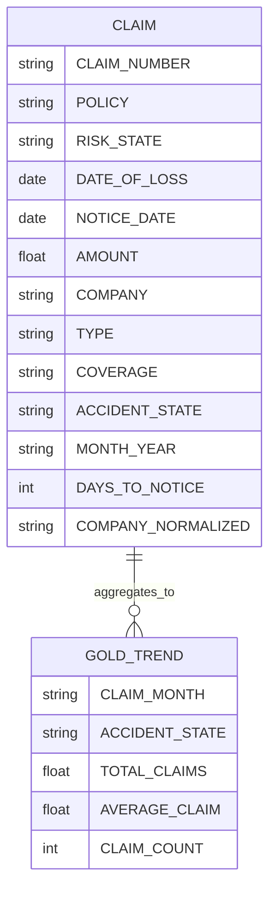
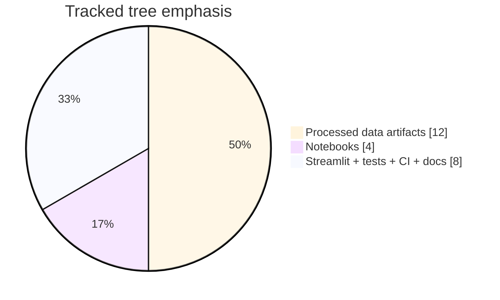

# Insurance Product Performance Analytics Platform

### Medallion claims ELT (Bronze → Silver/Staging → Gold) + Streamlit QC review for synthetic NTA/MTC portfolios

[](https://github.com/ArchanaChetan07/Insurance-Product-Performance-Analytics-Platform/actions/workflows/ci.yml)
[](https://www.python.org/)
[](claims_elt_pipeline.ipynb)
[](streamlit_ui/)
[](Data/processed/)
[](tests/test_insurance_product_perform.py)
[](#)

> End-to-end **insurance claims analytics lakehouse sample**: ingest synthetic NTA/MTC claims, enforce null-based **QC gates**, land clean rows in **staging (silver)**, repair failures via **Streamlit**, then aggregate to **gold** for state/month product performance and visualization notebooks.

**Repo:** [github.com/ArchanaChetan07/Insurance-Product-Performance-Analytics-Platform](https://github.com/ArchanaChetan07/Insurance-Product-Performance-Analytics-Platform)

---

## Verified data & warehouse facts

Counts below are read directly from committed artifacts under `Data/processed/` — **not invented**.

| Layer / artifact | Rows | Columns (key) | Path |
|---|---:|---|---|
| Cleaned claims (wide) | **18,928** | 15 — `CLAIM_NUMBER`, `POLICY`, `AMOUNT`, `COMPANY`, `ACCIDENT_STATE`, `DAYS_TO_NOTICE`, `COMPANY_NORMALIZED`, … | `Data/processed/claims_cleaned.csv` (+ parquet) |
| Staging / silver snapshot | **101** | 6 — `DATE`, `AMOUNT`, `COMPANY`, `ACCIDENT_STATE`, `CLAIM_ID`, `ERROR_REASON` | `Data/processed/staging/claims_staging.*` |
| QC failed queue | **1** | `CLAIM_ID`, `ERROR_REASON` | `Data/processed/qc_failed/claims_failed.*` |
| Gold trends (month × state) | **16** | `CLAIM_MONTH`, `ACCIDENT_STATE`, `TOTAL_CLAIMS`, `AVERAGE_CLAIM`, `CLAIM_COUNT` | `Data/processed/gold/claims_gold.*` |
| Gold by company × state | **16** | `COMPANY`, `ACCIDENT_STATE`, `TOTAL_CLAIMED_AMOUNT` | `Data/processed/gold/claims_cleaned.csv` |
| Gold trend states covered | **CA · FL · NY · TX** (4 months each) | — | `claims_gold.csv` |
| Σ `TOTAL_CLAIMS` in gold trends | **57,556** | — | sum of gold table |
| Mean of gold `AVERAGE_CLAIM` cells | **≈ 598.54** | — | gold table |
| Notebooks | **4** | ELT · staging→gold · aggregate · visualization | repo root |
| Tracked files on `main` | **24** | — | git tree |
| Unit tests | **7** | data hygiene + simple regression smoke | `tests/` |
| Operator UI | **2** Streamlit apps | QC review / push-to-staging | `streamlit_ui/` |



```mermaid
xychart-beta
    title Gold TOTAL_CLAIMS by state (summed over months in claims_gold.csv)
    x-axis [CA, FL, NY, TX]
    y-axis "TOTAL_CLAIMS" 0 --> 20000
    bar [10943, 13107, 19488, 14018]
```

> CA = 2167+1098+5811+1867 · FL = 2505+5966+3774+862 · NY = 6765+4238+6028+2457 · TX = 5253+4417+2485+1863

---

## Problem → solution

Insurance product performance work needs more than charts: it needs a **governed medallion path** and a **human-in-the-loop** for QC failures before aggregates are trusted.

This platform demonstrates:

1. **Ingest** synthetic NTA/MTC claims Excel → cleaned bronze/wide fact  
2. **QC gate** on essential columns → split **staging** vs **qc_failed**  
3. **Operator repair** in Streamlit → push fixed rows back to staging  
4. **Gold aggregates** (month × state, company × state) for product KPIs  
5. **Visualization notebooks** for trends and company performance  

---

## Architecture (medallion + HITL)



### Operator control loop



### Data model (cleaned claims)



---

## Notebook pipeline

| Notebook | Role |
|---|---|
| `claims_elt_pipeline.ipynb` | Raw Excel → clean → QC → **staging** + **qc_failed** (CSV & Parquet) |
| `03_staging_to_gold.ipynb` | Promote staging into curated gold inputs |
| `04_aggregate_to_gold.ipynb` | Build KPI aggregates (month/state, company/state) |
| `claims_Visulization.ipynb` | Charts / trends (incl. committed `claims_trends_by_state.png`) |

QC logic (from ELT notebook): essential columns must be non-null; any null → `qc_failed`, else `qc_passed` → staging.

---

## Streamlit QC apps

| App | Purpose |
|---|---|
| `streamlit_ui/claims_review_app.py` | Bulk data-editor + approve-all to staging |
| `streamlit_ui/Streamlit.py` | Row-picker edit + push single record |

Paths resolve **relative to the repo** (`Data/processed/...`) so clones work without a hard-coded Desktop path.

```bash
streamlit run streamlit_ui/claims_review_app.py
# or
streamlit run streamlit_ui/Streamlit.py
```

---

## Gold KPI snapshot (committed)

From `Data/processed/gold/claims_gold.csv` (Jan–Apr 2023 × CA/FL/NY/TX):

| CLAIM_MONTH | Example cells |
|---|---|
| 2023-01 | NY TOTAL_CLAIMS **6,765** (13 claims) · TX **5,253** (9) · FL **2,505** (4) · CA **2,167** (5) |
| 2023-02 | FL **5,966** (10) · TX **4,417** (9) · NY **4,238** (7) · CA **1,098** (2) |
| 2023-03 | NY **6,028** (11) · CA **5,811** (8) · FL **3,774** (8) · TX **2,485** (4) |
| 2023-04 | NY **2,457** (3) · CA **1,867** (3) · TX **1,863** (2) · FL **862** (2) |

```mermaid
xychart-beta
    title CLAIM_COUNT by month (summed across CA/FL/NY/TX)
    x-axis [2023-01, 2023-02, 2023-03, 2023-04]
    y-axis "Claims" 0 --> 40
    bar [31, 28, 31, 10]
```

---

## Repository layout

```text
Insurance-Product-Performance-Analytics-Platform/   ← 24 tracked files
├── claims_elt_pipeline.ipynb
├── 03_staging_to_gold.ipynb
├── 04_aggregate_to_gold.ipynb
├── claims_Visulization.ipynb
├── Data/
│   ├── raw/NTA_MTC_Claims_Synthetic_Data.xlsx
│   └── processed/
│       ├── claims_cleaned.csv|.parquet
│       ├── staging/
│       ├── qc_failed/
│       └── gold/
├── streamlit_ui/
│   ├── claims_review_app.py
│   └── Streamlit.py
├── tests/test_insurance_product_perform.py
├── requirements.txt
├── *.pdf / *.docx requirement & overview docs
└── .github/workflows/ci.yml
```



---

## Quick start

```bash
git clone https://github.com/ArchanaChetan07/Insurance-Product-Performance-Analytics-Platform.git
cd Insurance-Product-Performance-Analytics-Platform

python -m venv .venv
# Windows: .\.venv\Scripts\Activate.ps1
source .venv/bin/activate

pip install -r requirements.txt
pytest tests/ -q

# QC review UI (uses Data/processed under this repo)
streamlit run streamlit_ui/claims_review_app.py

# Explore pipelines
jupyter notebook claims_elt_pipeline.ipynb
```

> Notebooks may still reference legacy absolute Desktop paths from the original Databricks workspace run. Committed `Data/processed/` outputs are the portable lakehouse snapshot; prefer those paths or update notebook cells to `Path("Data/...")` when re-running locally.

---

## Skills surface

`Python` · `pandas` · `NumPy` · `medallion architecture` · `Bronze / Silver / Gold` · `ELT` · `data quality / QC gates` · `Parquet` · `CSV lakehouse` · `Streamlit` · `human-in-the-loop data repair` · `insurance analytics` · `NTA / MTC synthetic claims` · `product performance KPIs` · `matplotlib` / `seaborn` · `openpyxl` · `pytest` · `GitHub Actions` · `Databricks-style notebook workflows`

---

## Design notes

1. **QC before gold** — failed rows never silently pollute product aggregates.  
2. **Operator HITL** — Streamlit is part of the warehouse control plane, not a side demo.  
3. **Dual format** — staging/gold land as **CSV + Parquet** for notebook and engine portability.  
4. **Honest metrics** — row counts and gold sums are from committed files; synthetic domain data only.

---

## Roadmap

- Parameterize remaining notebook absolute paths to repo-relative `Data/`  
- Publish DQ metric cards (pass rate, fail reasons) as auto-generated markdown from staging/gold  
- Optional Spark/Databricks job YAML wrapping the same medallion stages  

---

## Author

**Archana Chetan** · [@ArchanaChetan07](https://github.com/ArchanaChetan07)

Built to demonstrate **insurance data platform skills**: medallion ELT, QC partitioning, operator repair UX, and gold KPI modeling on synthetic NTA/MTC claims.

---

## License

See repository license if present. Supporting docs: requirement PDF + Databricks overview DOCX in repo root.
