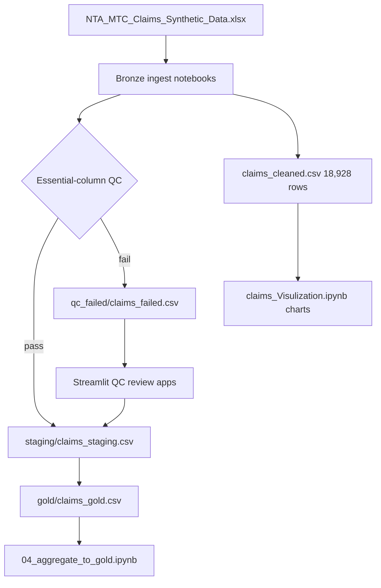

# Insurance Product Performance Analytics Platform

### Medallion claims ELT — staging QC, gold aggregates, and Streamlit review over synthetic NTA data

[](https://github.com/ArchanaChetan07/Insurance-Product-Performance-Analytics-Platform/actions/workflows/ci.yml)
[](https://www.python.org/)
[](tests/test_insurance_product_perform.py)
[](streamlit_ui/)
[](#license)

Insurance claims analytics pipeline with **bronze → staging → gold** layers: ingest synthetic NTA MTC claims (Excel), run QC splits for failed rows, aggregate monthly/state metrics, visualize product performance, and review QC failures in Streamlit before promoting records to staging.

---

## Key Results

| Metric | Value | Source |
|---|---|---|
| Notebooks | **4** (ELT, visualization, staging→gold, aggregate) | repo root |
| NTA synthetic raw columns | **148** | `claims_Visulization.ipynb` output |
| Cleaned claims rows | **18,928** | `Data/processed/claims_cleaned.csv` |
| ELT demo bronze rows | **100** (4 insurers × 4 states) | `claims_elt_pipeline.ipynb` |
| Staging rows (committed) | **101** | `Data/processed/staging/claims_staging.csv` |
| QC failed rows (committed) | **1** | `Data/processed/qc_failed/claims_failed.csv` |
| Gold aggregate rows | **16** (month × state) | `Data/processed/gold/claims_gold.csv` |
| Streamlit QC apps | **2** | `streamlit_ui/` |
| Unit tests | **7** | `tests/test_insurance_product_perform.py` |

---

## Architecture



**How it works:** `claims_elt_pipeline.ipynb` loads claims, profiles missing values, splits rows with null essential fields into QC-failed vs staging CSV/Parquet, and charts state distributions. `03_staging_to_gold.ipynb` aggregates staging into monthly gold metrics. Streamlit apps let analysts edit failed rows and promote them to staging. `claims_Visulization.ipynb` processes the full 148-column NTA synthetic export for EDA and cleaning.

---

## Tech Stack

| Layer | Choice |
|---|---|
| Language | Python 3.10 |
| Data | pandas, openpyxl (Excel), fuzzywuzzy |
| Viz | matplotlib, seaborn |
| ML (analytics helpers) | scikit-learn LinearRegression in tests |
| UI | Streamlit (`st.data_editor` for QC fixes) |
| CI | GitHub Actions + pytest + flake8 |

---

## Features

- Medallion-style folders: `staging/`, `qc_failed/`, `gold/`
- QC gate on essential columns with separate failed-row quarantine
- CSV + Parquet exports from ELT notebook
- Monthly gold table: `CLAIM_MONTH`, `ACCIDENT_STATE`, `TOTAL_CLAIMS`, `AVERAGE_CLAIM`, `CLAIM_COUNT`
- Company/state aggregation notebook with bar charts
- Streamlit workflows to fix and approve QC-failed claims
- Prophet listed in requirements for time-series extension

---

## Installation & Usage

```bash
git clone https://github.com/ArchanaChetan07/Insurance-Product-Performance-Analytics-Platform.git
cd Insurance-Product-Performance-Analytics-Platform
python -m venv .venv
# Windows: .venv\Scripts\activate
source .venv/bin/activate
pip install -r requirements.txt
```

```bash
# Run ELT + QC split (update raw Excel path in notebook first)
jupyter notebook claims_elt_pipeline.ipynb

# Staging → gold aggregation
jupyter notebook 03_staging_to_gold.ipynb

# QC review UI (point base_dir to Data/processed in app)
streamlit run streamlit_ui/Streamlit.py

# Tests
pytest tests/ -v
```

**Note:** notebooks reference local Databricks paths for the raw Excel file; update paths or place data under `Data/raw/` before running.

---

## Project Structure

```text
Insurance-Product-Performance-Analytics-Platform/
├── claims_elt_pipeline.ipynb        # bronze ingest + QC split
├── claims_Visulization.ipynb        # 148-col NTA EDA + cleaning
├── 03_staging_to_gold.ipynb         # staging → gold metrics
├── 04_aggregate_to_gold.ipynb       # company/state aggregates
├── streamlit_ui/
│   ├── Streamlit.py                 # row-by-row QC fixer
│   └── claims_review_app.py         # bulk approve to staging
├── Data/processed/
│   ├── staging/claims_staging.csv
│   ├── qc_failed/claims_failed.csv
│   ├── gold/claims_gold.csv
│   └── claims_cleaned.csv
├── tests/test_insurance_product_perform.py
└── .github/workflows/ci.yml
```

---

## Future Improvements

- Parameterize data paths via `.env` instead of hard-coded Databricks directories
- Wire Streamlit apps to repo-relative `Data/processed/` paths by default
- Add dbt or Airflow orchestration over notebook stages
- Persist QC audit trail when rows move from failed → staging

---

## License

See repository license file if present.
